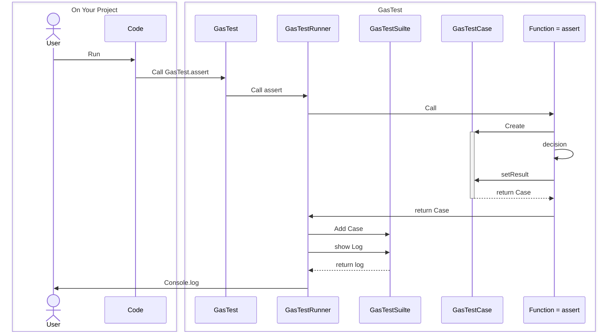

# GasTest
## For you to be confident is intended
あなたが自信を持つことが出来るように

Google Apps Scriptのためのユニットテストフレームワーク．

## イントロ

# name

image or gif

## Overview

## Requirement

## Usage

## Features

## Reference

## Author

[twitter](https://twitter.com/Kotabrog)

## Licence

[MIT](https://......)

これで含むはわかる？
alert(rabbit instanceof Animal); // true
