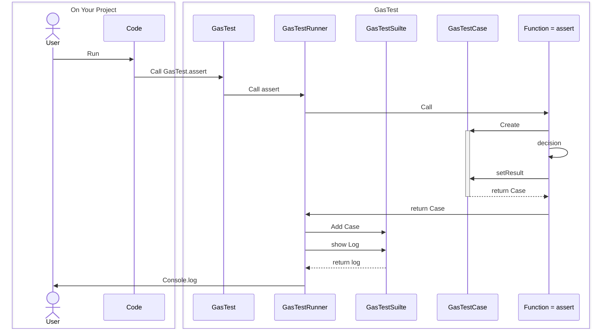

<p align="center">
    
</p>
<p align="center">
<a href='https://github.com/google/clasp'>
    
</a>
</p>


## Sample Code
```javascript
    function myFunction() {
      GasTest.assert(true,'Hello GasTest');
      GasTest.assert(true);
      GasTest.assertTrue(true);
      GasTest.assertFalse(false);
      GasTest.assertEqual(1,1);
      GasTest.assertNotEqual(1,2);
    }
```
# name

image or gif

## Overview

## Requirement

## Usage

## Features

## Reference

## Author

[twitter](https://twitter.com/Kotabrog)

## Licence

[MIT](https://......)



これで含むはわかる？
alert(rabbit instanceof Animal); // true
